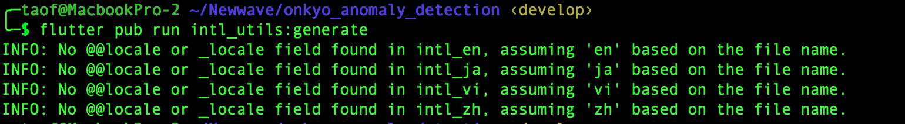

# README.md

## Tại sao là Markdown
- File markdown được viết để tạo ra nội dung mô tả cho một dự án, một repository, một project nào đó.

## Hướng dẫn chạy app
- Lấy source code từ github

```
git clone https://github.com/taoquynh/demo-markdown
```
- Cài đặt thư viện

```
cd /DemoMarkdown
```

```
pod install
```

## Một số hình ảnh của project




